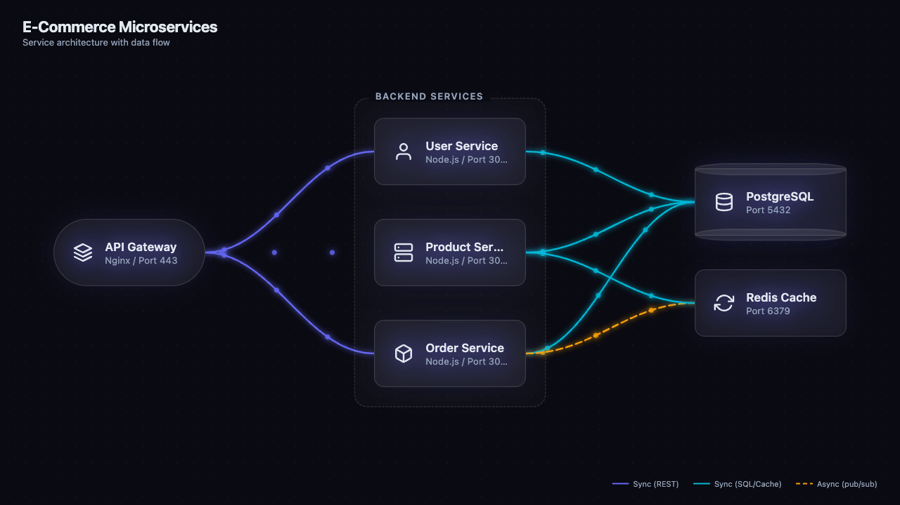

<p align="center">
  
</p>

# Cartographer

Animated software architecture diagrams as self-contained HTML files. An [agent skill](https://skills.sh) that generates dark neon glassmorphic diagrams with zero external dependencies — all CSS, JS, and SVG inline in a single `.html` file.

## Example

<p align="center">
  
</p>

## Quick Start

```bash
# Install the skill
npx skills add stevederico/cartographer

# Generate a diagram from a description
"draw an architecture diagram for a web app with an API, database, and cache"

# Generate from your codebase
"diagram this system from codebase"
```

## Features

- **Self-contained HTML** — single file, zero CDN links, zero dependencies
- **Dark neon glass aesthetic** — glassmorphic nodes, glowing edges, dot-grid background
- **Animated particles** — flowing dots along edges show data direction
- **Staggered entrance animations** — nodes and edges fade in sequentially
- **Interactive** — hover highlight, node tooltips, edge tooltips (request/response), zoom/pan, double-click reset
- **Auto-layout** — topological sort, layer assignment, crossing minimization
- **20 built-in icons** — Lucide-style SVGs (server, database, globe, cloud, lock, etc.)
- **5 node shapes** — rect, cylinder, hexagon, circle, stadium
- **4 edge types** — sync, secondary, async, error (each with distinct color and style)
- **Print stylesheet** — white background, no animations for clean printing

## Diagram Types

| Type | When to Use |
|---|---|
| **System Context** | High-level overview with external actors |
| **Container** | Services, databases, and queues within a system |
| **Microservices Map** | Service mesh with sync/async dependencies |
| **Data Flow** | How data moves through the system |
| **Sequence / Request Flow** | Single request traced across services |
| **Deployment** | Cloud resources, regions, and networking |
| **Event-Driven** | Event bus with producers and consumers |

## How It Works

```
  User prompt
       |
       v
  +-----------+
  |  Gather   |  Scan codebase or parse description
  +-----------+
       |
       v
  +-----------+
  | Identify  |  Nodes, edges, groups
  +-----------+
       |
       v
  +-----------+
  |  Layout   |  Topological sort → layer assignment
  |           |  → crossing minimization → positions
  +-----------+
       |
       v
  +-----------+
  | Generate  |  Single .html with inline CSS + JS + SVG
  +-----------+
       |
       v
  +-----------+
  |   Open    |  Launch in default browser
  +-----------+
```

1. **Gather** — Reads codebase files (`package.json`, `docker-compose.yml`, route files, DB connections) or parses a text description.
2. **Identify** — Extracts nodes (services, databases, queues), edges (REST, gRPC, SQL, pub/sub), and groups (logical clusters).
3. **Layout** — Auto-positions nodes using a layered graph algorithm with crossing minimization.
4. **Generate** — Writes a single HTML file with all styles, animations, icons, and interactivity inline.
5. **Open** — Launches the diagram in the default browser.

## Interactivity

Every generated diagram includes:

| Feature | Behavior |
|---|---|
| **Hover highlight** | Dims unconnected nodes/edges to 15% opacity |
| **Node tooltips** | Shows label, subtitle, tech stack on hover |
| **Edge tooltips** | Shows method, endpoint, request/response data on hover |
| **Zoom / Pan** | Mouse wheel zooms toward cursor, click-drag pans |
| **Double-click reset** | Resets zoom and centers the diagram |

## File Structure

```
cartographer/
├── SKILL.md                          # Skill definition (install target)
├── references/
│   ├── design-system.md              # CSS palette, node shapes, animations
│   ├── icons.md                      # 20 Lucide-style SVG icons
│   └── layout-algorithm.md           # Auto-layout algorithm reference
└── examples/
    └── example-microservices.html    # Working demo — open in browser
```

## Icon Library

20 built-in icons in Lucide style (24x24, 2px stroke, round caps):

`server` · `database` · `globe` · `user` · `cloud` · `lock` · `mail` · `zap` · `cpu` · `hard-drive` · `git-branch` · `shield` · `activity` · `layers` · `smartphone` · `terminal` · `box` · `wifi` · `key` · `refresh-cw`

## Constraints

- **Max 30 nodes** per diagram — split larger systems by domain
- **Zero external dependencies** — no CDN, no `<script src>`, no `<link href>`
- **System font stack** — `system-ui, -apple-system, BlinkMacSystemFont, 'Segoe UI', sans-serif`

## License

MIT
